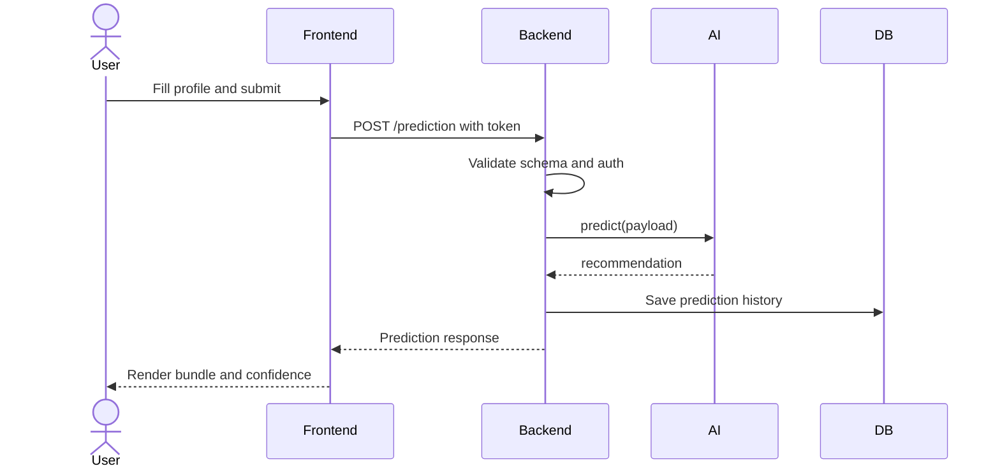

  

# Olea-Insurance

Full-stack ML application that serves real-time predictions via a FastAPI backend and React front-end. Includes automated CI/CD with GitHub Actions and deployed on Vercel + Render, built during OLEA hackathon (final version).

You can check out our application yourself using this link !
https://olea-insurance.vercel.app/

## 🚀 What It Does

Olea-Insurance is a comprehensive insurance recommendation assistant that provides:

- **Secure User Authentication:** Visitor sign up, login, and secured profile access.
- **Smart Bundle Predictions:** Machine Learning-driven insurance bundle recommendations based on user profile and input data.
- **RAG-based Insurance Chat:** An AI assistant powered by a Retrieval-Augmented Generation (RAG) pipeline to dynamically answer context-specific insurance questions.
- **Prediction History:** Automatically records and retrieves user prediction and chat histories.

## 🏗️ Architecture & Planning

Instead of heavy enterprise documentation, we utilized a streamlined architecture designed for rapid deployment and a clear separation of concerns between our ML and RAG inference capabilities.

## 🛠️ Tools & Tech Stack

Our stack was carefully selected to optimize performance and reduce friction during ML integration:

- **Frontend:** React + Vite
- **Backend (API Layer):** FastAPI (Python)
- **Database:** MySQL via SQLAlchemy ORM
- **Machine Learning:** Scikit-learn (`model.pkl` using XGBClassifier to predict bundle probabilities)
- **Generative AI (RAG):** Pinecone (Vector database) + Embedding model + TinyLlama
- **DevOps & Cloud Deployment:** Docker, GitHub Actions (CI/CD Pipeline), Vercel (Frontend Hosting), Render (Backend Hosting)

## 📸 Screenshots

